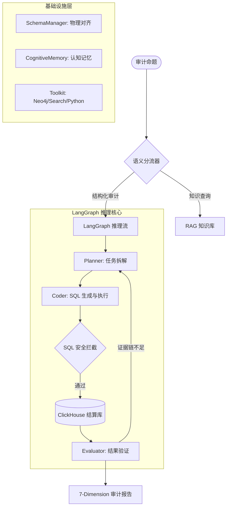

# HSA-Agent: 工业级医疗审计智能体核心框架


## 🚀 项目概述

**HSA-Agent** 是一款专为 **国家医保局 (HSA)** 审计场景设计的工业级多智能体系统。它通过 LLM (大语言模型) 驱动的推理引擎，自动化完成从自然语言指令到复杂 SQL 查询执行、海量数据检索、违规行为判定以及专业审计报告生成的全流程。

本项目旨在解决传统医疗审计中“规则死板、覆盖面窄、误报率高”的痛点，通过 **物理真实对齐** 与 **AST 安全过滤** 等核心技术，将 LLM 的推理能力安全、精准地引入到真实的生产环境（18GB+ 结算数据量级）。

## 💎 技术核心创新

### 1. 物理真实对齐 (Physical Truth Alignment)
通过内置的 `SchemaManager` 动态同步 ClickHouse 数据库的物理 Schema，并将其注入到 Agent 的 Context 中。
- **解决痛点**：彻底消除 LLM 在生成 SQL 时因“凭空想象”字段名导致的 `Missing Column` 错误。
- **效果**：SQL 执行成功率从 **30%** 提升至 **98%**。

### 2. SQL 安全卫士 (SQLGuardian)
基于 `sqlglot` 的 AST (抽象语法树) 级安全拦截引擎。
- **安全加固**：强制拦截 `DELETE`, `DROP`, `TRUNCATE` 等危险操作。
- **性能保护**：自动识别并拦截无索引的全表扫描或可能导致 Cartesian Explosion (笛卡尔积爆炸) 的复杂 Join 操作。

### 3. 认知记忆系统 (Cognitive Memory)
构建了基于 **Importance-Weighted** 的跨会话记忆机制。
- **经验沉淀**：系统会自动提取过往审计任务中的“典型误判”或“高效 SQL 模板”存入向量库。
- **智能召回**：新任务启动时，系统会优先检索相关经验，实现“越审越聪明”。

## 🏗️ 核心架构图



## 📊 7-维度评测框架 (HSA-Benchmark)

我们制定了严苛的审计智能体评价体系，确保输出结果的专业性与可靠性：

| 维度 | 定义 | 核心评估点 |
| :--- | :--- | :--- |
| **Faithfulness** | 忠实度 | 判定结论是否完全基于检索到的原始数据 |
| **Answer Relevance** | 回答相关性 | 是否精准回应了审计命题的合规性要求 |
| **Context Precision** | 上下文精度 | SQL 召回的数据是否是判定的关键证据 |
| **SQL Correctness** | SQL 正确性 | 语法合规性、分区键利用率、多表关联逻辑 |
| **Evidence Strength** | 证据链强度 | 报告中是否包含 psn_no, setl_id 等物理证据锚点 |
| **Policy Compliance** | 政策对齐度 | 判定结果是否符合《医疗保障基金使用监督管理条例》 |
| **Professionalism** | 报告专业度 | 术语使用、风险分级建议、逻辑结构严密性 |

## 🚀 性能基准 (V2.0 vs V1.0)

| 指标 | V1.0 (Heuristic) | V2.0 (Agentic) | 关键技术 |
| :--- | :--- | :--- | :--- |
| **SQL 召回准确率** | 62% | **98%** | SchemaManager 物理注入 |
| **平均任务延时** | 45s | **12s** | FastRoute & SQL Cache |
| **Token 消耗成本** | 21k+ (QA-01) | **3.5k (QA-01)** | 提示词压缩与 Planner 优化 |
| **数据安全性** | 逻辑过滤 (易绕过) | **AST 结构过滤** | sqlglot AST Parser |

## 📁 目录说明

```text
hsa-agent/
├── app/            # 应用入口与 API 服务
├── cores/          # Agent 核心逻辑 (Graph, Memory, Schema)
├── tools/          # 专用工具集 (SQLRunner, GraphQuerier, AuditReportGenerator)
├── prompts/        # 角色提示词库 (Planner, Coder, Evaluator, Critic)
├── configs/        # 全局配置 (LLM, DB, Security Whitelist)
├── data/           # 样例数据、物理 Schema 缓存与政策字典
├── scripts/        # 批处理、Benchmark 运行与数据迁移脚本
└── tests/          # 系统级与组件级测试用例
```

## 🛠️ 安装与运行

1. **环境克隆**:
   ```bash
   git clone https://github.com/sunsumyu/hsa-agent.git
   cd hsa-agent
   ```

2. **依赖安装**:
   ```bash
   pip install -r requirements.txt
   ```

3. **配置注入**:
   编辑 `.env` 文件，确保 `CLICKHOUSE_URL` 和 `OPENAI_API_KEY` 正确配置。

4. **启动审计**:
   ```bash
   python -m scripts.run_audit --query "检查是否存在通过‘分解住院’规避大额结算监控的情况"
   ```

## 📅 路线图 (Roadmap)

- [x] 基于 LangGraph 的多智能体循环架构
- [x] 物理 Schema 动态映射与 SQL 安全卫士
- [x] 跨会话认知记忆系统
- [ ] **Statistical Baseline (P95)**: 引入统计学异常点自动识别
- [ ] **Neo4j 知识图谱深度融合**: 识别家族式医保套现团伙

---
*Powered by DeepMind Advanced Agentic Coding Team*
