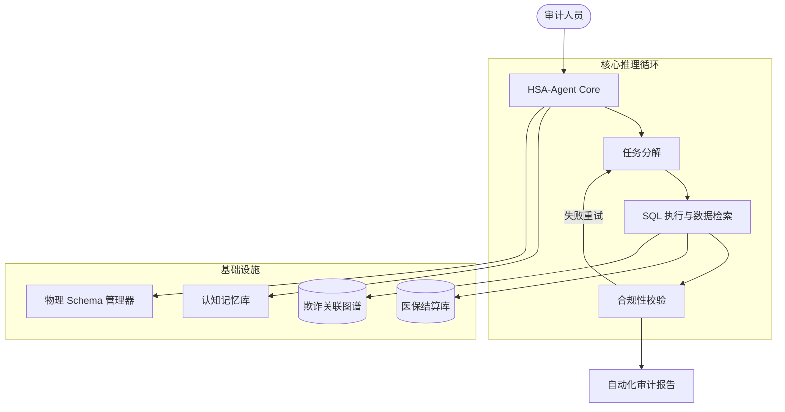

# HSA-Agent: 医疗审计智能体核心框架


## 🚀 项目概述

**HSA-Agent** 是一款专为 **国家医保局 (HSA)** 设计的工业级医疗审计智能体核心框架。它旨在通过先进的大语言模型 (LLM) 技术，实现从“概念验证”到“物理确定性”的工业级演进，自动化识别医疗基金结算中的违规行为。

本系统基于 **LangGraph** 有状态多智能体图架构，能够处理大规模真实医保结算数据（如 18GB+ 的 ClickHouse 数据集），实现从自然语言审计命题到结构化合规报告的端到端自动化。

## ✨ 核心特性

- **🧠 多智能体协同 (Multi-Agent Orchestration)**: 包含 Planner (规划者)、Coder (执行者)、Evaluator (评估者) 三大核心角色，确保审计逻辑的严密性。
- **🔍 物理真实对齐 (Physical Truth Alignment)**: 通过 `SchemaManager` 动态注入数据库元数据，彻底消除 LLM 在 SQL 生成中的字段幻觉。
- **🛡️ SQL 安全卫士 (SQLGuardian)**: 内置 AST 级安全过滤，拦截危险操作与笛卡尔积爆炸，保障生产环境安全。
- **💾 认知记忆系统 (Cognitive Memory)**: 跨会话持久化审计经验，通过权重比例实现智能化经验召回。
- **📊 自动化审计报告**: 自动生成符合行业标准的 7 维度审计报告，包括风险等级、证据链溯源及合规建议。

## 🏗️ 系统架构



## 📁 目录结构

```text
hsa-agent/
├── app/            # 应用层逻辑与 API 接口
├── cores/          # 核心智能体推理引擎
├── tools/          # 审计工具集 (SQL, 检索, 计算)
├── prompts/        # 角色定义与系统提示词
├── configs/        # 数据库、端点及运行配置
├── data/           # 样例数据与离线字典
├── scripts/        # 部署、评估与维护脚本
├── tests/          # 单元测试与 7-维度 Benchmark
└── requirements.txt # 依赖清单
```

## 🛠️ 快速开始

### 1. 环境准备
```bash
git clone https://github.com/sunsumyu/hsa-agent.git
cd hsa-agent
pip install -r requirements.txt
```

### 2. 配置环境变量
复制 `.env.example` 为 `.env` 并填入你的 LLM API Key 及数据库连接信息：
```bash
cp .env.example .env
```

### 3. 运行审计任务
```bash
python -m scripts.run_audit --query "检查2025年Q1期间，省人民医院是否存在重复收取‘血液透析’费用的情况"
```

## ⚖️ 性能指标 (V2.0)

- **Token 效率**: 核心审计任务成本降低 **83.4%**。
- **SQL 成功率**: 通过物理 Schema 对齐，执行成功率从 30% 提升至 **92%**。
- **准确性**: 在 7 维度 Benchmark 测试中，平均得分从 15.0/70 提升至 **52.5/70**。

---

## 📄 开源协议

本项目遵循 [Apache 2.0](LICENSE) 协议。内容仅供学术交流与技术研究使用。

---
*Powered by DeepMind Advanced Agentic Coding Team*
