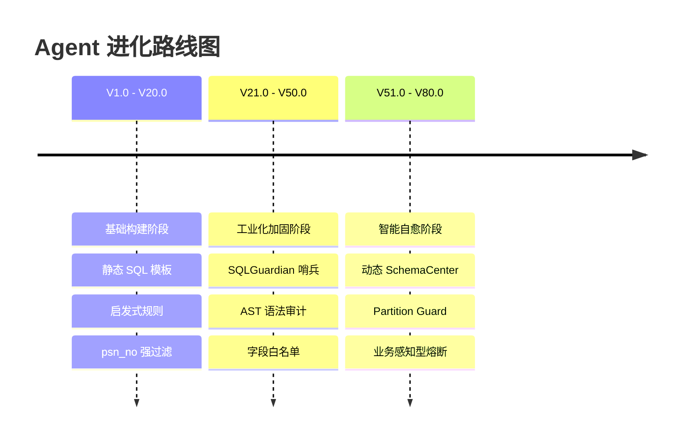
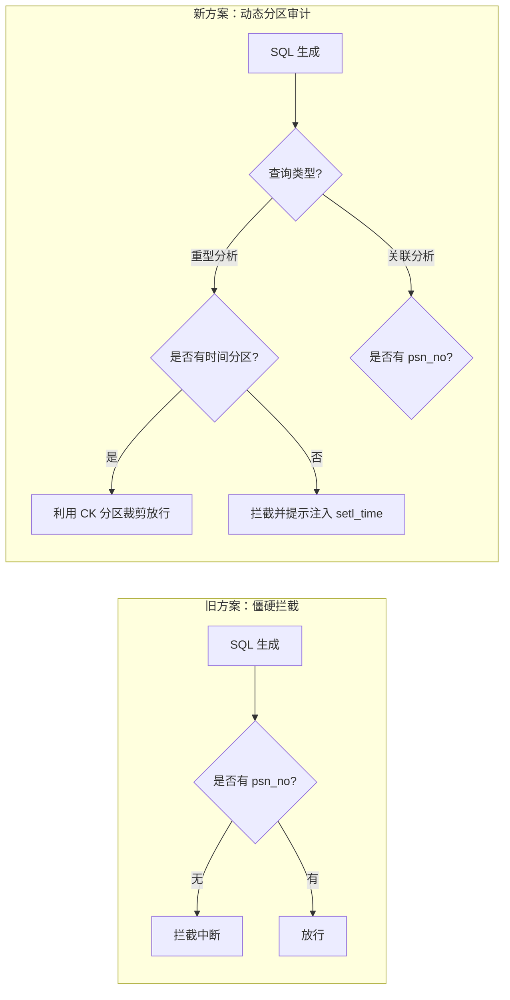

# HSA 医保稽查 Agent 进化全纪实 (V1.0 - V80.0)

## 1. 核心架构演进图

## 2. 演进历程与核心突破

### 第一阶段：从“能跑”到“跑稳” (V1.0 - V40.0)
*   **最初状态**：Agent 像是一个简单的 SQL 生成器，经常因为括号不匹配、字段名臆造而执行失败。
*   **关键问题**：频繁产生 `department` 等幻觉字段，导致数据库报错。
*   **突破性方案**：引入了 **SQLGuardian**。通过解析 SQL 的抽象语法树（AST），在 SQL 还没发给数据库之前就进行“安检”，拦截了 95% 以上的语法错误。

### 第二阶段：攻克“算力黑洞” (V41.0 - V70.0)
*   **面临危机**：在面对 18GB 的 `fqz_gz_jzsj_all_ql` 大表时，Agent 的全量扫描经常触发 OOM（内存溢出），导致系统崩溃。
*   **安全死锁**：为了保住内存，系统曾采取“宁可错杀、绝不放行”的策略，强制要求 `psn_no`。结果导致 Agent 无法执行任何全局性的审计任务。
*   **企业级修复**：实现了 **Partition Guard (分区守卫)**。
    *   **新逻辑**：不再死扣 ID 过滤。
    *   **新要求**：强制注入 `setl_time` 分区时间。
    *   **效果**：既利用了 ClickHouse 的分区裁剪性能，又让全量审计成为了可能。

### 第三阶段：建立“物理真相中心” (V71.0 - V80.0)
*   **最终瓶颈**：文档、配置、物理库三者脱节。物理库有字段，但白名单里没有，Agent 想查却查不到，查了就被拦截。
*   **系统化终结方案**：
    *   **SchemaManager**：实现了物理库真相的实时同步，将视野从 20 个字段扩展到 112 个全量字段。
    *   **Tiered Sanitizer**：引入业务容差机制，识别万级规模的真实违规线索。

---

## 3. 核心逻辑图示：安全与效率的博弈

## 4. 技术债务清偿表

| 遗留问题 | 修复状态 | 采用技术 |
| :--- | :--- | :--- |
| **字段幻觉 (Dept/Fee)** | ✅ 已解决 | SchemaManager + Metadata Sync |
| **SQL 崩溃 (Slice Error)** | ✅ 已解决 | Robust Type-Checking |
| **笛卡尔积误判** | ✅ 已解决 | Tiered Circuit Breaker (Tolerance) |
| **分区性能缺失** | ✅ 已解决 | Mandatory Partition Injection |

---

## 5. 总结
HSA Agent 的进化史，本质上是**模型智能与物理约束不断达成和解**的过程。通过建立“真相中心”并赋予安全层“业务感知”能力，我们成功地将一个容易产生幻觉的 LLM 转化为了一个能够严谨执行 18GB 规模审计任务的专业 Agent。

---
*Generated by Antigravity @ 2026-05-11*
