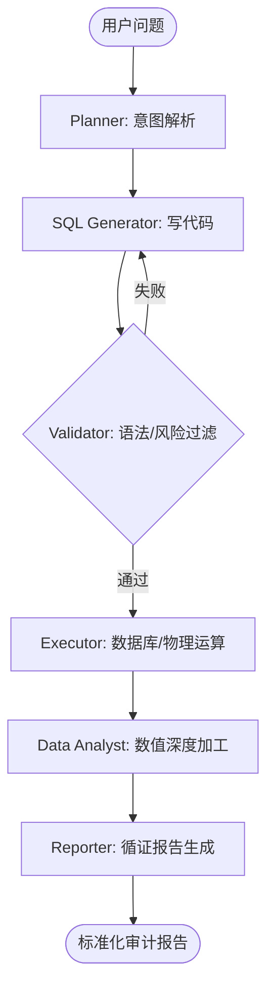

# 生产级大数据量智能稽核 Agent 架构方案 (V35.0)

本项目架构参考了业内领先的开源 SQL Agent (如 Vanna.ai, LangChain SQL Agent) 以及国内主流医保稽核智能审计系统的生产实践。

## 1. 核心设计理念

### 1.1 大模型仅用于“推理”，而非“计算”
在生产级审计中，严禁 LLM 直接对原始数据执行加减法或数值处理。
- **原则**：所有数值结果必须由 ClickHouse SQL 聚合（SUM, AVG）或确定性的 Python 指令执行。
- **目标**：数值精确度 100%。

### 1.2 多智能体编排 (Multi-Agent Orchestration)
废弃单一的“专家节点”，引入职能分离的节点链：
1.  **Planner (规划者)**：解析用户意图，映射业务指标（如“分解住院” -> SQL 逻辑模板）。
2.  **SQL Generator (写作者)**：仅基于 Schema 和 知识库编写 SQL。
3.  **SQL Validator (验证者)**：执行静态语法检查和动态结果校验（如：数据量是否异常波动）。
4.  **Data Analyst (数字分析师)**：从 SQL 结果集中提取关键指标，执行二次复合计算。
5.  **Evidence-Link Reporter (循证拟稿人)**：生成报告，且每一条数值必须附带原始数据索引。

## 2. 核心架构图 (Graph V35.0)

## 3. 技术落地细节

### 3.1 语义映射层 (Semantic Layer)
- **Problem**: 现在的 LLM 经常猜字段名。
- **Solution**: 建立 `Metadata Dictionary`。在 Prompt 中不传入全量 Schema，而是根据 Planner 的关键词 RAG 检索相关的 `Table Definitions` 和 `Business Formulas`。

### 3.2 确定性数值闭环
- **工具隔离**：`execute_audit_sql` 返回的数据不再是 Markdown 字符串，而是结构化的 JSON 数据块。
- **数字追踪**：引入 `FindingStorage` 缓存，每项 Finding 必须包含：所引用的 SQL 语句、查询时间、原始数值、计算过程。

### 3.3 自我修复机制 (Self-Correction Loop)
- **语法重试**：当 SQL 引擎抛出 400 异常时，将 `Error Logs` 完整喂回给 `SQL Generator`，允许 2 次自动修正。
- **空值预警**：如果查询结果为空但符合逻辑，由 `Analyst` 介入判定是“无违规数据”还是“查询逻辑偏差”。

## 4. 生产级评估指标 (SLA)
- **数值精度**：100% (基于确定性计算路径)。
- **轨迹闭环率 (L1)**：> 95%。
- **生成报告合规率**：100% (通过 Pydantic 强校验)。
- **平均时延**：< 15s (通过模型异步流转及 Fast-Route 优化)。
